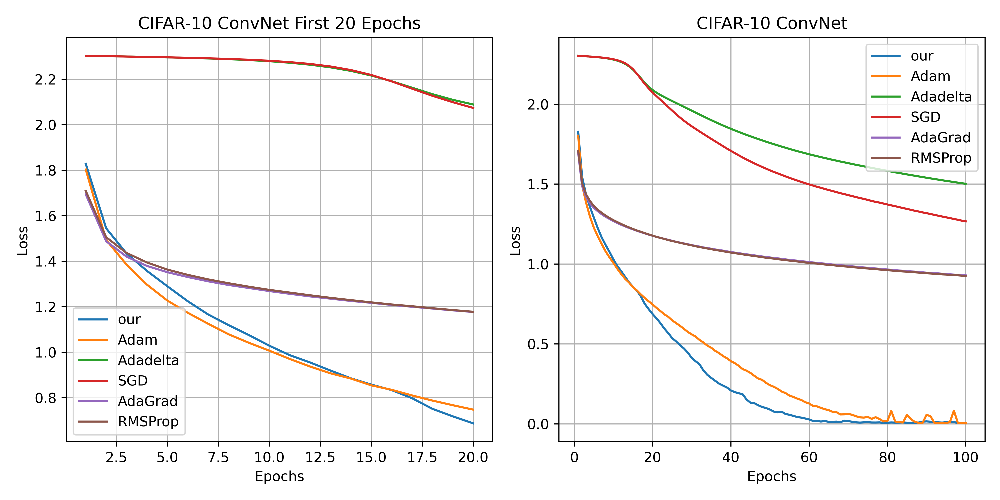
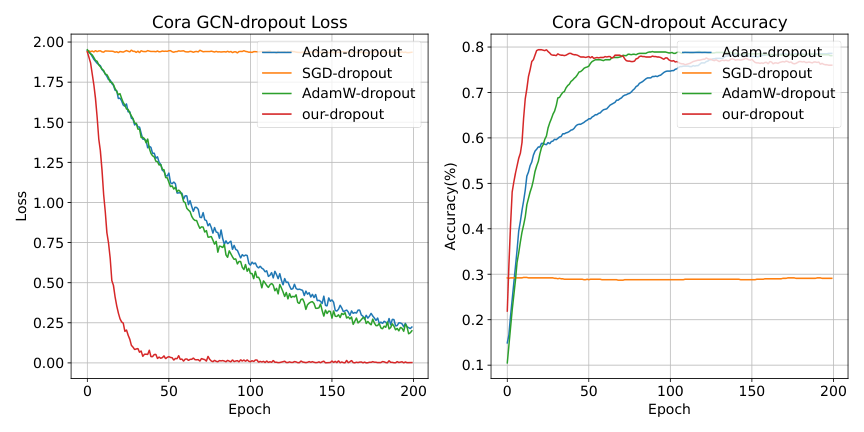

# DWMGrad Optimizer

This repository contains an implementation of the DWMGrad optimizer: 
it relies on historical information to dynamically guide momentum and learning rate updates to adapt to different training scenarios, thereby improving performance in various situations.

## Experiments

### Rosenbrock Function: Classical unconstrained optimization problem
result
 

### CIFAR-10: Image classification
result
 

### MINST: Image classification
result
 

### Core: Text classification
result

## performance

|          | CIFAR-10 | MINST | Core | Rosenbrock |
|----------|----------|-------|------|------------|
| other-op | 0        | 0     | 0    | 0          |
| our-op   | 1        | 1     | 1    | 1          |

1 represents a better performance in this experiment.

## More
More details are being worked out.

